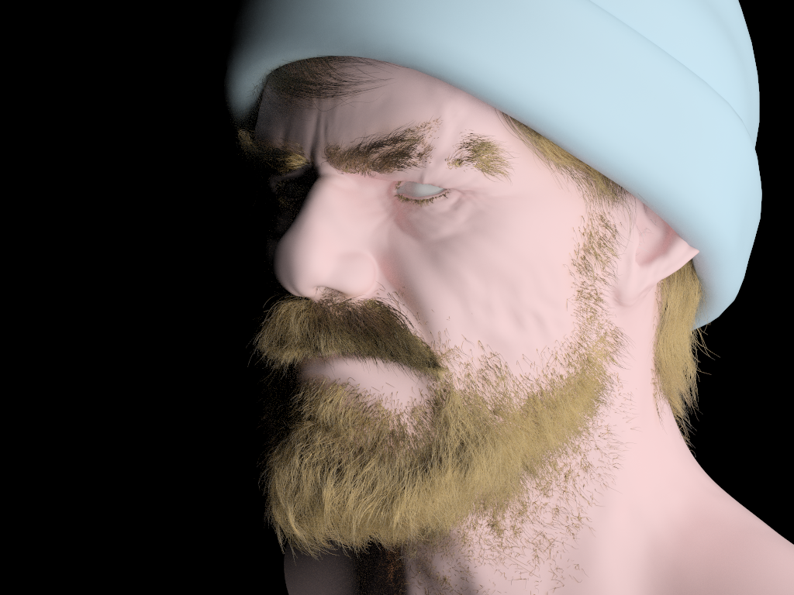

# Strelka
Path tracing render based on NVIDIA OptiX + NVIDIA MDL and Apple Metal
## OpenUSD Hydra render delegate

## Basis curves support

## Project Dependencies

OpenUSD https://github.com/PixarAnimationStudios/OpenUSD

* Set evn var: `USD_DIR=c:\work\USD_build`

OptiX 
* Set evn var: `OPTIX_DIR=C:\work\OptiX SDK 8.0.0`

Download MDL sdk (for example: mdl-sdk-367100.2992): https://developer.nvidia.com/nvidia-mdl-sdk-get-started

* unzip content to /external/mdl-sdk/

LLVM 12.0.1 (https://github.com/llvm/llvm-project/releases/tag/llvmorg-12.0.1) for MDL ptx code generator

* for win: https://github.com/llvm/llvm-project/releases/download/llvmorg-12.0.1/LLVM-12.0.1-win64.exe
* for linux: https://github.com/llvm/llvm-project/releases/download/llvmorg-12.0.1/clang+llvm-12.0.1-x86_64-linux-gnu-ubuntu-16.04.tar.xz
* install it to `c:\work` for example
* add to PATH: `c:\work\LLVM\bin`
* extract 2 header files files from external/clang12_patched to `C:\work\LLVM\lib\clang\12.0.1\include`

Strelka uses conan https://conan.io/

* install conan: `pip install conan` 

detect conan profile: `conan profile detect --force`

1. `conan install . --output-folder=build --build=missing --settings=build_type=Debug`
2. `cd build`
3. `cmake .. -G "Visual Studio 17 2022" -DCMAKE_TOOLCHAIN_FILE=conan_toolchain.cmake`

On Mac/Linux:
1. `conan install . -c tools.system.package_manager:mode=install -c tools.system.package_manager:sudo=True --build=missing --settings=build_type=Debug`
2. `cd build/Debug`
3. `source ./generators/conanbuild.sh`
4. `cmake ../.. -DCMAKE_TOOLCHAIN_FILE=generators/conan_toolchain.cmake -DCMAKE_BUILD_TYPE=Debug`
5. `cmake --build .`

### Libs:
- glfw    - https://www.glfw.org/     *dll*
- cxxopts   - https://github.com/jarro2783/cxxopts  *header*
- imgui   - https://github.com/ocornut/imgui *header+source*
- glm      - https://github.com/g-truc/glm *submodule*
- stb       - https://github.com/nothings/stb *submodule*
- doctest      - https://github.com/onqtam/doctest *submodule*

#### Installation

#### Launch
    
## Synopsis 

    Strelka -s <USD Scene path> [OPTION...] positional parameters

    -s, --scene arg       scene path (default: "")
    -i, --iteration arg  Iteration to capture (default: -1)
    -h, --help            Print usage

To set log level use

    export SPDLOG_LEVEL=debug
The available log levels are: trace, debug, info, warn, and err.

## Example

    ./Strelka -s misc/coffeemaker.usdc -i 100

## USD
    USD env:
        export USD_DIR=/Users/<user>/work/usd_build/
        export PATH=/Users/<user>/work/usd_build/bin:$PATH
        export PYTHONPATH=/Users/<user>/work/usd_build/lib/python:$PYTHONPATH

    Cmake:
        cmake -DCMAKE_INSTALL_PREFIX=/Users/<user>/work/usd_build/plugin/usd/ ..

    Install plugin:
        cmake --install . --component HdStrelka

## License
* USD plugin design and material translation code based on Pablo Gatling code:
https://github.com/pablode/gatling